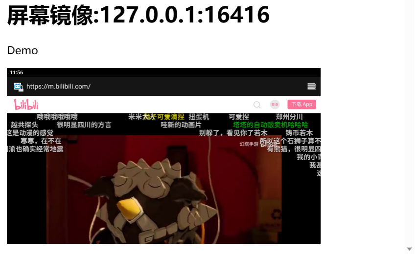
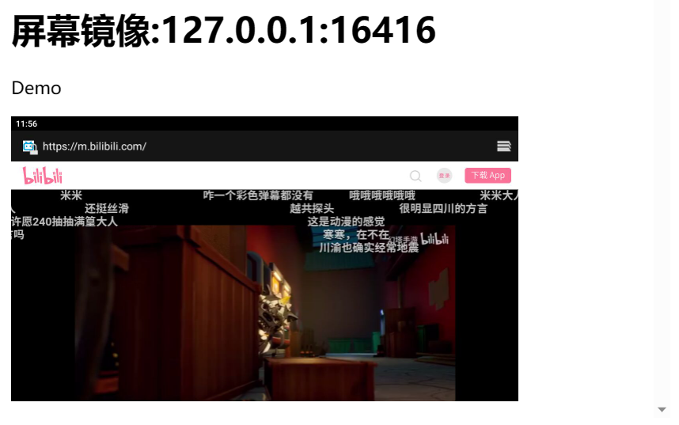

# 说明
用于android设备远程实时控制的工具整合包。
- 封装了[minicap](https://github.com/bbsvip/minicap_minitouch_prebuilt/tree/main) 、 [minicap_sdk32](https://github.com/UrielCh/minicap-prebuilt)、 [minitouch](https://github.com/bbsvip/minicap_minitouch_prebuilt/tree/main) 、[ADBKeyboard](https://github.com/senzhk/ADBKeyBoard) 的预编译包
- 支持多线程（threading）中资源自动分配，但应避免在多进程（multiprocessing）中使用
- 支持多设备连接
- 支持安卓设备的实时截图(延迟约30~40ms)
- 支持修改分辨率
- 支持监听屏幕旋转
- 支持监听输入框弹出
- 内置触控点坐标变换
- 支持中文输入
- 包含一个远程控制demo
- 支持安卓系统版本android<=12, sdk<=32

# 适用场景
- 有一定实时性要求的安卓游戏自动控制项目
- 需要从不同线程控制、获取屏幕内容的多线程项目

# 安装

```shell
pip install anhelper
```

# Demo
运行demo需要确保已经通过adb连接安卓设备

```shell
anhelper-demo
```

# 已知问题
- 实体机上可能存在输入设备写入权限问题，导致minitouch无法运行。需要adb获取root权限。
- 部分机器需要手动在设置中开启ADBKeyboard并且手动切换输入法才可用。

# 用于安卓控制的同类开源项目推荐
- [uiautomator2](https://github.com/openatx/uiautomator2)
- [scrcpy](https://github.com/Genymobile/scrcpy)
- [QtScrcpy](https://github.com/barry-ran/QtScrcpy)
- [minidevice](https://github.com/NakanoSanku/minidevice/tree/dev)


# 在python项目中使用

## Device


```python
from anhelper import device
device.listDevices()
```


    {'127.0.0.1:16416': ['device',
      'product:SDY-AN00',
      'model:SDY_AN00',
      'device:SDY-AN00',
      'transport_id:24'],
     '127.0.0.1:21513': ['device',
      'product:SM-S9010',
      'model:SM_S9010',
      'device:SM-S9010',
      'transport_id:23']}


```python
# 通过网络连接设备
device.connectDevice('127.0.0.1', port=16416)
```


    True


```python
device.listDevices()
```


    {'127.0.0.1:16416': ['device',
      'product:SDY-AN00',
      'model:SDY_AN00',
      'device:SDY-AN00',
      'transport_id:24'],
     '127.0.0.1:21513': ['device',
      'product:SM-S9010',
      'model:SM_S9010',
      'device:SM-S9010',
      'transport_id:23']}


```python
# 获取adb连接的第一个设备
# getDevice已对多线程进行了优化，不同线程中调用不会重复构建实例
dev = device.getDevice()
```


```python
# 检查是否处于输入法输入状态
dev.getIMEInputActive()
```


    False


```python
# 获取屏幕显示参数
dev.getWM()
```


    {'width': 1280, 'height': 720, 'density': 240}


```python
%%time
# 获取屏幕方向（顺时针旋转）
dev.getOrientation()
```

    CPU times: total: 0 ns
    Wall time: 86.9 ms
    


    0


```python
# 修改分辨率
dev.setWM(720, 1280, fit_orientation = True)
dev.getWM()
```


    {'width': 1280, 'height': 720, 'density': 240}


```python
dev.setWM(**device.CONST.TABLET_720P, fit_orientation = True)
dev.getWM()
```


    {'width': 1280, 'height': 720, 'density': 240}


## ime


```python
from anhelper import ime
# 获取默认设备的ADBKeyboard输入法对象
mime = ime.getIME()
```


```python
# 检查ADBKeyboard是否是默认输入法
mime.getSelected()
```


    False


```python
%%time
# 等待输入完成
mime.inputSafe('你好')
```

    正在安装ADBkeyboard。。。ok
    CPU times: total: 15.6 ms
    Wall time: 540 ms
    


    'Broadcasting: Intent { act=ADB_INPUT_B64 flg=0x400000 (has extras) }\r\nBroadcast completed: result=0'


```python
%%time
# 输入且不等待完成
mime.input('你好')
```

    CPU times: total: 15.6 ms
    Wall time: 3.91 ms
    


    <Popen: returncode: None args: 'adb -s 127.0.0.1:16416 shell "am broadcast -...>


```python
## 多设备
mime2 = ime.getIME(list(device.listDevices().keys())[1])
mime2.input('再见')
```


    <Popen: returncode: None args: 'adb -s 127.0.0.1:21513 shell "am broadcast -...>


## Minicap


```python
from anhelper import minicap
from anhelper.utils.visualizehelper import *
# 获取默认设备的minicap输入法对象
mcap = minicap.getMinicap()
```


```python
# 截图默认返回cv2格式BGR矩阵
# sync=True 获取当前时间之后的第一帧
imat = mcap.cap(sync = True)
imshow(imat)
```


    

    


```python
%%time
# 对于静态画面minicap不会发送新的帧，所以同步截图设置了1秒超时
imat = mcap.cap(sync=True)

```

    CPU times: total: 15.6 ms
    Wall time: 37.1 ms
    


```python
%%time
# sync=False 跳过等待直接从缓存中取帧
imat = mcap.cap(sync=False)
```

    CPU times: total: 15.6 ms
    Wall time: 15.6 ms
    


```python
# 用完记得关
mcap.close()
```

## Minitouch


```python
from anhelper import minitouch
import time
# 获取默认设备的minicap输入法对象
touch = minitouch.getMinitouch()
```


```python
%%time
# 由于触控设备通常支持多个触控点，使用useContact()自动分配触控点，以避免冲突
# 所有的触控操作推荐使用比例坐标而非绝对坐标
# 比例坐标：x = 绝对坐标x/屏幕宽度, y=绝对坐标y/屏幕高度, 0 <= x,y <= 1
with touch.useContact() as c:
    c.swipe(0.5,0.2, 0.5, 0.4, duration_ms=3000)
    print(c.id)
    
with touch.useContact() as c:
    print(c.id)
    c.tap(1000, 500)
    c.tap(0.5, 0.5)

```

    正在部署minitouch。。。ok
    9
    8
    CPU times: total: 78.1 ms
    Wall time: 1.94 s
    


```python
%%time
# 同一个触控点的操作会覆盖掉上一个操作未完成的部分
with touch.useContact() as c:
    c.swipe(0.5,0.2, 0.5, 0.4, duration_ms=3000)
    time.sleep(2)
    print(c.inuse)
    c.swipe(0.5,0.2, 0.5, 0.4, duration_ms=3000)
```

    True
    CPU times: total: 78.1 ms
    Wall time: 2.01 s
    


```python
%%time
with touch.useContact() as c:
    c.swipe(0.5, 0.4, 0.5, 0.6, duration_ms=3000)
```

    CPU times: total: 46.9 ms
    Wall time: 53.7 ms
    


```python
%%time
with touch.useContact() as c:
    c.tap(0.9, 0.7)

```

    CPU times: total: 0 ns
    Wall time: 976 µs
    


```python
# 绝对坐标也可以使用但不推荐，坐标原点为旋转后的屏幕左上角，与截图坐标一致
with touch.useContact() as c:
    c.tap(700, 500)
```


```python
# 用完记得关
touch.close()
```

## WebUI（Demo）


```python
from anhelper import webui
from IPython.display import IFrame
```


```python
# 创建一个webui，绑定默认设备（连接的第一个），可以使用不同的device_id来绑定不同设备
# webui可以在网页中同步显示设备屏幕的内容
# divice_id 可以通过 device.listDevices()获取
ui = webui.WebUI(device_id=None)
ui.start()
```


```python
# 检查webui是否正在运行
ui.is_alive()
```


    True


```python
IFrame( ui.url, width='100%',height='400px')
```





    127.0.0.1 - - [29/Jul/2023 23:56:15] "GET / HTTP/1.1" 200 -
    

    正在部署minicap。。。ok
   

    127.0.0.1 - - [29/Jul/2023 23:56:16] "GET /video_feed HTTP/1.1" 200 -
    


```python
ui2 = webui.WebUI(device_id=None, port=5001)
ui2.start()
```


```python
ui2.is_alive()
```


    True


```python
IFrame( ui2.url, width='100%',height='400px')
```





    127.0.0.1 - - [29/Jul/2023 23:56:20] "GET / HTTP/1.1" 200 -
    127.0.0.1 - - [29/Jul/2023 23:56:20] "GET /video_feed HTTP/1.1" 200 -
    


```python
# 关闭webui
# 多个webui可以指向同一个设备，可以分别创建和关闭
ui2.stop()
```


```python
ui.stop()
```


```python

```

# 包含开源项目许可声明

[minicap](https://github.com/DeviceFarmer/minicap/blob/master/LICENSE)

[minitouch](https://github.com/DeviceFarmer/minitouch/blob/master/LICENSE)

[ADBKeyBoard](https://github.com/senzhk/ADBKeyBoard/blob/master/LICENSE)

[vue](https://github.com/vuejs/core/blob/main/LICENSE)

[pure.css](https://github.com/pure-css/pure/blob/master/LICENSE)

[fontawesome](https://fontawesome.com/license/free)